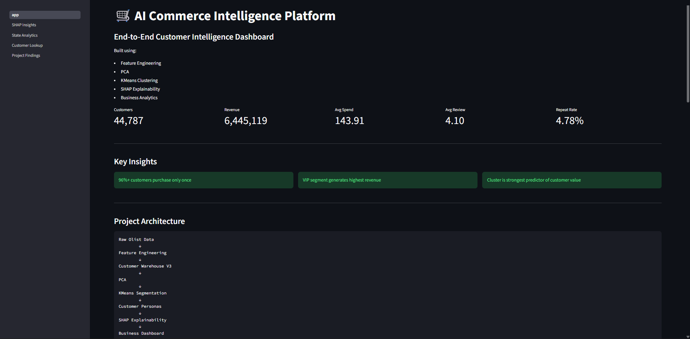
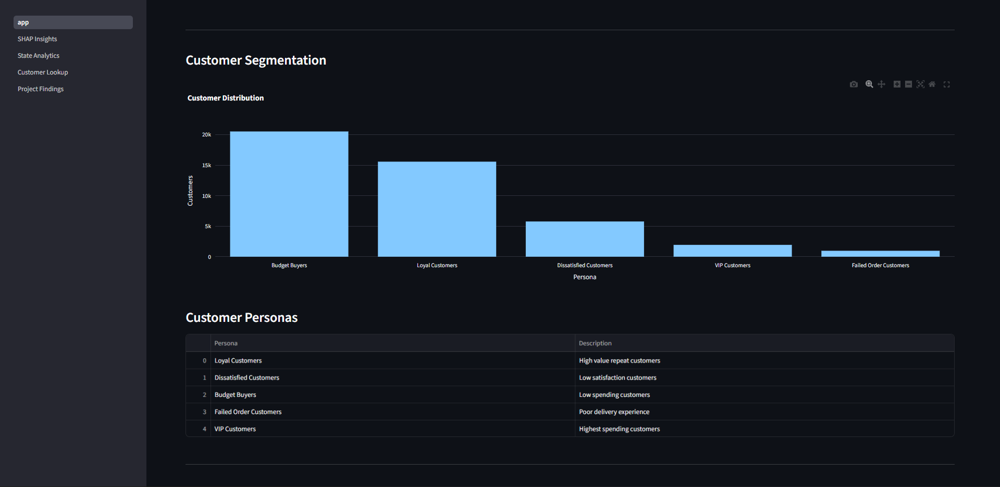
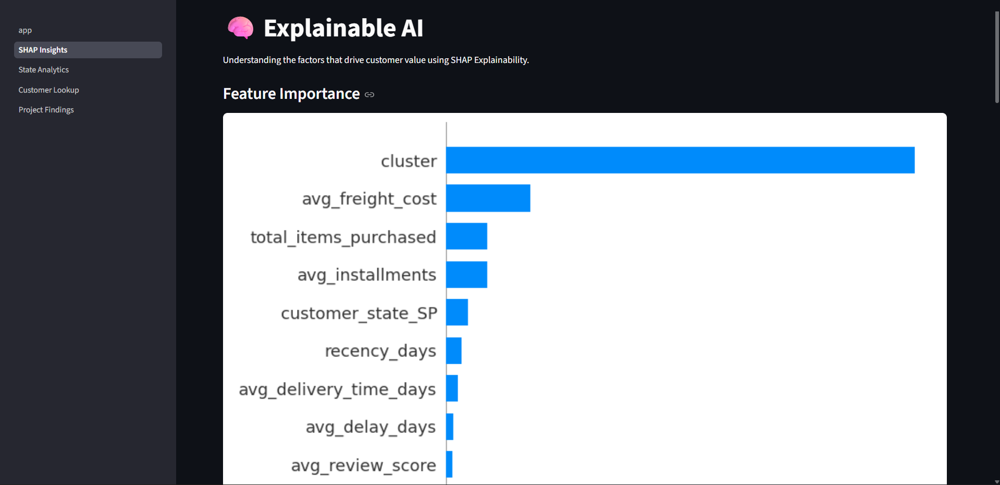
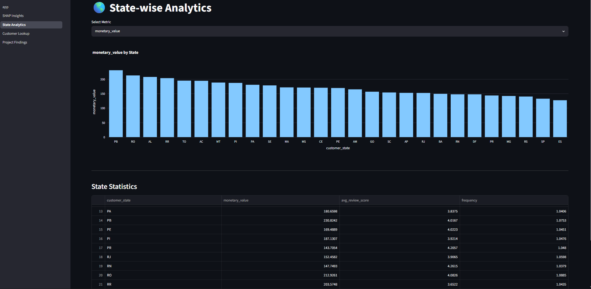
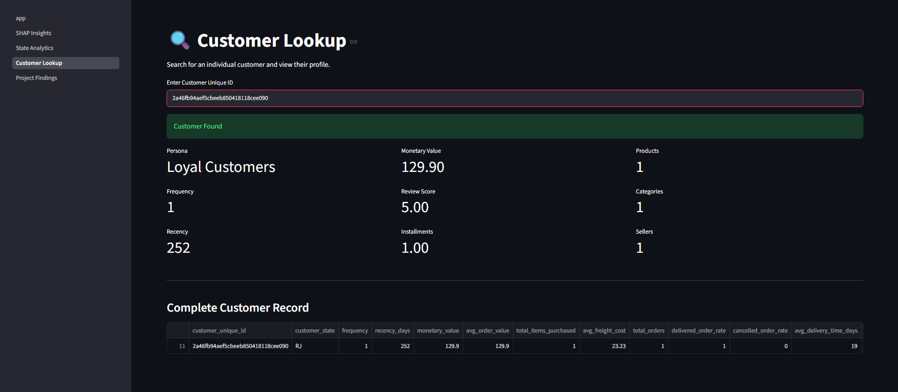

# 🛒 AI Commerce Intelligence Platform

An end-to-end Machine Learning and Business Intelligence platform built using the Olist Brazilian E-Commerce Dataset.

The project transforms raw e-commerce data into actionable customer intelligence through feature engineering, customer segmentation, explainable AI, and interactive dashboards.

---

# 🚀 Project Overview

This project combines:

- Data Engineering
- Exploratory Data Analysis
- Feature Engineering
- PCA Dimensionality Reduction
- Customer Segmentation
- Explainable AI (SHAP)
- Interactive Business Intelligence Dashboard

The goal is to help businesses understand customer behavior, identify valuable customer segments, and derive actionable insights from transactional data.

---

# 📊 Dashboard Preview

## Overview Dashboard



---

## Customer Segmentation



---

## Explainable AI



---

## State Analytics



---

## Customer Lookup



---

# 🏗 Project Architecture

```text
Raw Olist Data
        ↓
Data Cleaning
        ↓
Feature Engineering
        ↓
Customer Warehouse V3
        ↓
PCA
        ↓
KMeans Segmentation
        ↓
Customer Personas
        ↓
SHAP Explainability
        ↓
Interactive Dashboard
```

---

# 📂 Project Structure

```text
AI-Commerce-Intelligence-Platform/

├── data/
│   └── processed/

├── models/

├── notebooks/

├── reports/

├── streamlit_app/
│   ├── app.py
│   ├── pages/
│   ├── assets/
│   └── utils/

├── requirements.txt

└── README.md
```

---

# ⚙️ Features

## Customer Analytics

- Revenue Analysis
- Review Analysis
- Delivery Analysis
- State-wise Analytics

---

## Customer Segmentation

Discovered 5 customer personas:

| Cluster | Persona |
|----------|----------|
| 0 | Loyal Customers |
| 1 | Dissatisfied Customers |
| 2 | Budget Buyers |
| 3 | Failed Order Customers |
| 4 | VIP Customers |

---

## Explainable AI

Used SHAP to identify the strongest drivers of customer value.

Top Drivers:

1. Customer Segment
2. Average Freight Cost
3. Total Items Purchased
4. Installments
5. Purchase Frequency

---

# 🔍 Key Findings

## Customer Retention

- More than 96% of customers purchase only once.
- Customer retention is a major business challenge.

---

## Revenue Distribution

- Revenue is highly concentrated among a small percentage of customers.
- VIP customers contribute significantly more revenue than other segments.

---

## Customer Value Drivers

Customer value is driven primarily by:

- Customer Segment
- Basket Size
- Freight Cost
- Purchase Behavior

rather than customer review scores.

---

## Data Leakage Discovery

During model development, potential data leakage was identified in repeat-purchase and customer-value classification tasks.

This led to a shift from predictive modeling toward behavior analysis and explainable customer intelligence.

---

# 🧠 Machine Learning Techniques Used

## Dimensionality Reduction

- PCA

---

## Clustering

- KMeans

---

## Explainability

- SHAP

---

## Classification Experiments

- Logistic Regression
- Random Forest
- XGBoost

---

# 🛠 Tech Stack

## Programming

- Python

## Data Processing

- Pandas
- NumPy

## Visualization

- Matplotlib
- Seaborn
- Plotly

## Machine Learning

- Scikit-Learn
- XGBoost
- SHAP

## Dashboard

- Streamlit

---

# ▶️ Running Locally

Clone the repository:

```bash
git clone https://github.com/shourya-tiwari/AI-Commerce-Intelligence-Platform.git
```

Install dependencies:

```bash
pip install -r requirements.txt
```

Run the dashboard:

```bash
streamlit run streamlit_app/app.py
```

---

# 📈 Future Improvements

- Streamlit Cloud Deployment
- Real-Time Data Integration
- Customer Lifetime Value Forecasting
- Recommendation System
- Advanced Marketing Analytics

---

# 👨‍💻 Author

Shourya Tiwari

B.Tech Artificial Intelligence & Machine Learning

Symbiosis Institute of Technology, Pune